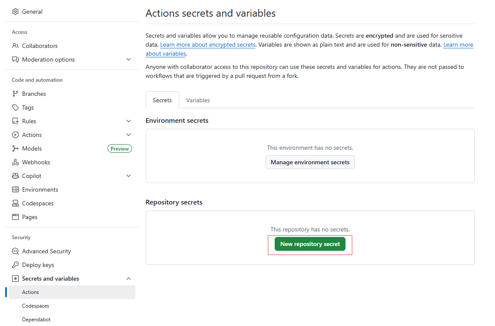
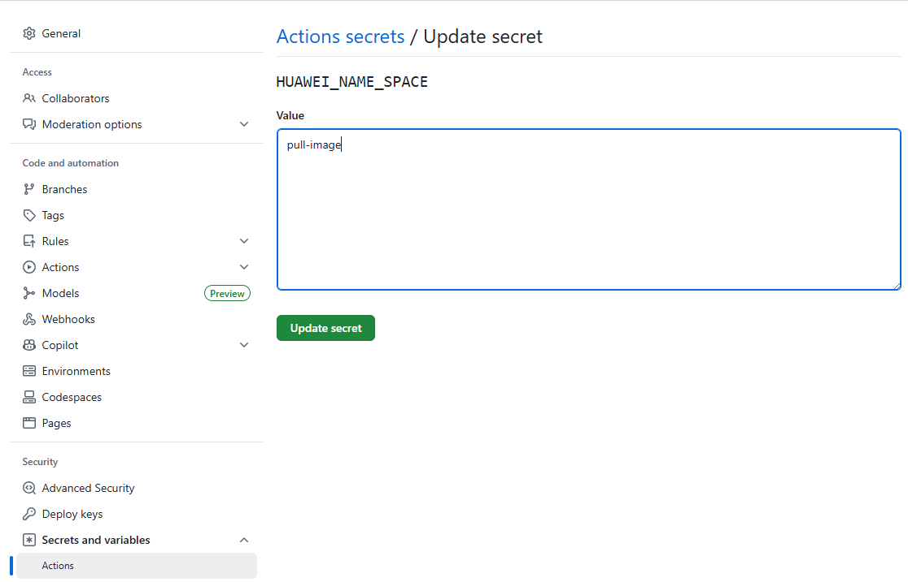
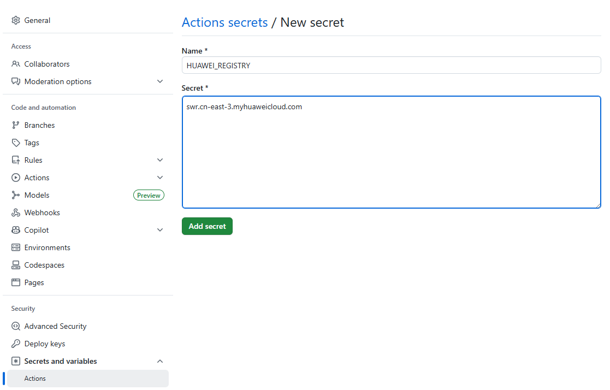
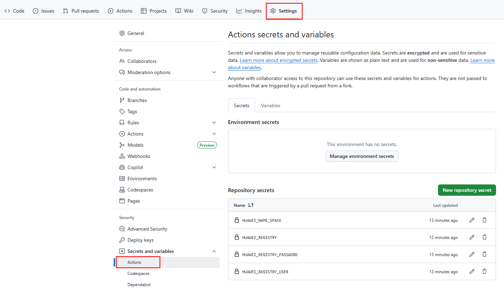
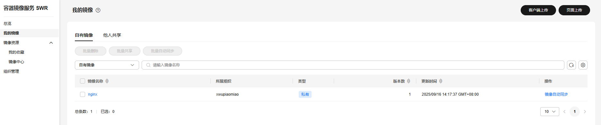
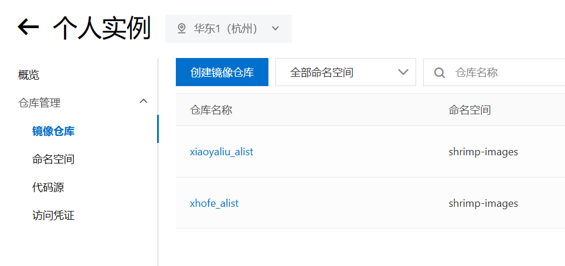

# Docker Images Push

使用Github Action将国外的Docker镜像转存到华为云私有仓库，供国内服务器使用，免费易用<br>
- 支持DockerHub, gcr.io, k8s.io, ghcr.io等任意仓库<br>
- 支持最大10GB的大型镜像<br>
- 使用华为云的官方线路，速度快<br>


## 使用方式


### 配置华为云
登录华为云容器镜像服务<br>
https://console.huaweicloud.com/swr/<br>
启用个人实例，创建一个命名空间（**HUAWEI_NAME_SPACE**）


客户端上传–>生成登陆指令–>长期有效指令–>获取访问密钥–>导入访问密钥<br>
用户名（**HUAWEI_REGISTRY_USER**)<br>
密码（**HUAWEI_REGISTRY_PASSWORD**)<br>
仓库地址（**HUAWEI_REGISTRY**）<br>
```
docker login -u HUAWEI_REGISTRY_USER -p HUAWEI_REGISTRY_PASSWORD swr.cn-east-3.myhuaweicloud.com
```
注：
访问密钥文件名为：credentials.csv<br>
下载到桌面上后导入<br>


### Fork本项目
Fork本项目<br>
#### 启动Action
进入您自己的项目，点击Setting，启用Github Action功能<br>
#### 配置环境变量
进入Settings->Secret and variables->Actions->New Repository secret






将上一步的**四个值**<br>
HUAWEI_NAME_SPACE，HUAWEI_REGISTRY_USER，HUAWEI_REGISTRY_PASSWORD，HUAWEI_REGISTRY<br>
配置成环境变量

### 添加镜像
打开images.txt文件，添加你想要的镜像 
可以加tag，也可以不用(默认latest)<br>
可添加 --platform=xxxxx 的参数指定镜像架构<br>
可使用 k8s.gcr.io/kube-state-metrics/kube-state-metrics 格式指定私库<br>
可使用 #开头作为注释<br>

文件提交后，自动进入Github Action构建

### 使用镜像
回到华为云，镜像仓库，点击任意镜像，可查看镜像状态。(可以改成公开，拉取镜像免登录)


在国内服务器pull镜像, 例如：<br>
```
docker pull swr.cn-east-3.myhuaweicloud.com/pull-image/{镜像名称}:{版本名称}
```
swr.cn-east-3.myhuaweicloud.com 即 HUAWEI_REGISTRY(华为云仓库地址)<br>
pull-image 即 HUAWEI_NAME_SPACE(华为云命名空间)<br>
{镜像名称} 即 华为云中显示的镜像名<br>

### 多架构
需要在images.txt中用 --platform=xxxxx手动指定镜像架构
指定后的架构会以前缀的形式放在镜像名字前面


### 镜像重名
程序自动判断是否存在名称相同, 但是属于不同命名空间的情况。
如果存在，会把命名空间作为前缀加在镜像名称前。
例如:
```
xhofe/alist
xiaoyaliu/alist
```


### 定时执行
修改/.github/workflows/docker.yaml文件
添加 schedule即可定时执行(此处cron使用UTC时区)

